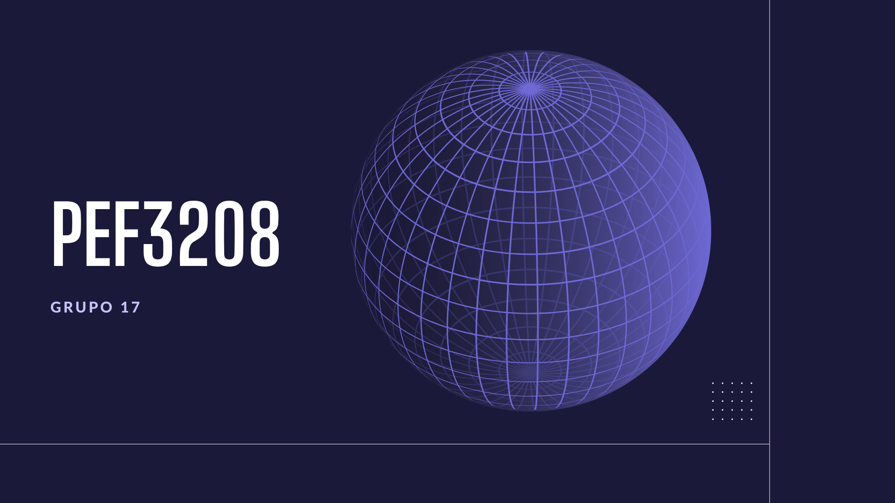

<h1 align="center">
  
</h1>

<h1 align="center">Projeto de PEF3208</h1>

<h1 align="center">
    <a href="https://threejs.org/">🔗 Three.js</a>
</h1>
<p align="center">🚀 lib para construir estruturas tridimensionais e cálculos de forças vinculares</p>


<p align="center">
 <a href="#objetivo">Objetivo</a> •
 <a href="#roadmap">Roadmap</a> • 
 <a href="#tecnologias">Tecnologias</a> • 
 <a href="#contribuicao">Contribuição</a> • 
 <a href="#licenc-a">Licença</a> 
</p>

<h4 align="center"> 
	🚧  🚀 Em construção...  🚧
</h4>

### Pré-requisitos

Antes de começar, você vai precisar ter instalado em sua máquina as seguintes ferramentas:
[Git](https://git-scm.com), [Node.js](https://nodejs.org/en/). 
Além disto é bom ter um editor para trabalhar com o código como [VSCode](https://code.visualstudio.com/)

### 🎲 Rodando a Aplicação (servidor do Three)

```bash
# Clone este repositório
$ git clone <https://github.com/lucascarvalho10/projeto-pef-3208>

# Acesse a pasta do projeto no terminal/cmd
$ cd project

# Instale as dependências
$ npm install

# Execute a aplicação em modo de desenvolvimento
$ npm run dev

# O servidor inciará na porta:3000 - acesse <http://localhost:3000>
```
		  

### 🛠 Tecnologias

As seguintes ferramentas foram usadas na construção do projeto:

- [Three.js](https://threejs.org/)
- [React](https://react-js.org/)
- [JavaScript](https://javascript.info/js)

